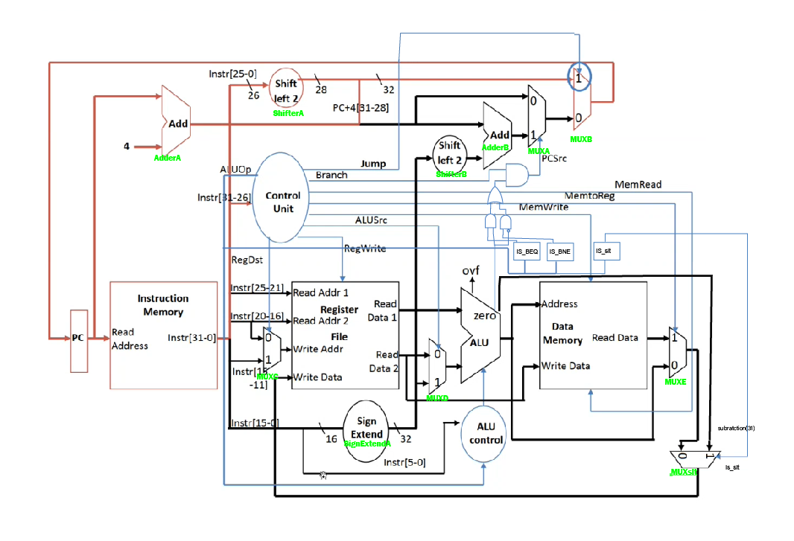

# Description

## A design of MIPS processor using VHDL that illustrates a basic computer system by simulating the data and control paths.

# Phase I

1.  Implemented the MIPS register file that reads simultaneously from
    two registers and write into another.

2.  Implemented 32-bit full ALU.

# Phase II

### Requirements:

Design a simple MIPS CPU Using VHDL. The proposed CPU should be able to
perform certain instructions: R-type (AND, OR, ADD, SUB, SLT and NOR),
I-type (lw, sw, beq, bne) and J instruction.

> **Test Case:**

-   Assembly program that calculates the first twelve Fibonacci numbers
    and store them in array at the beginning of the Data Memory.

-   After the program finishes, you should see the following sequence in
    \$s0: 1, 1, 2, 3, 5, 8, 13, 21, 34, 55, 89, 144, 0, 1.
